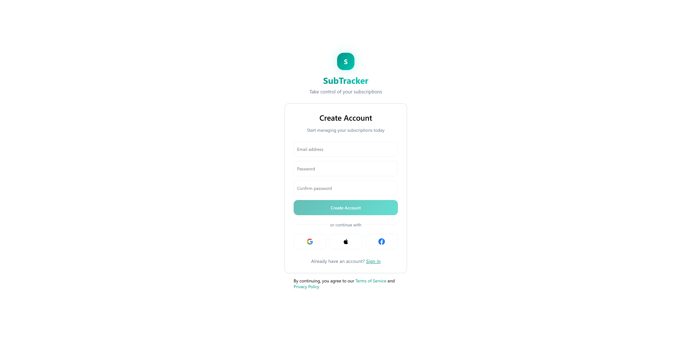
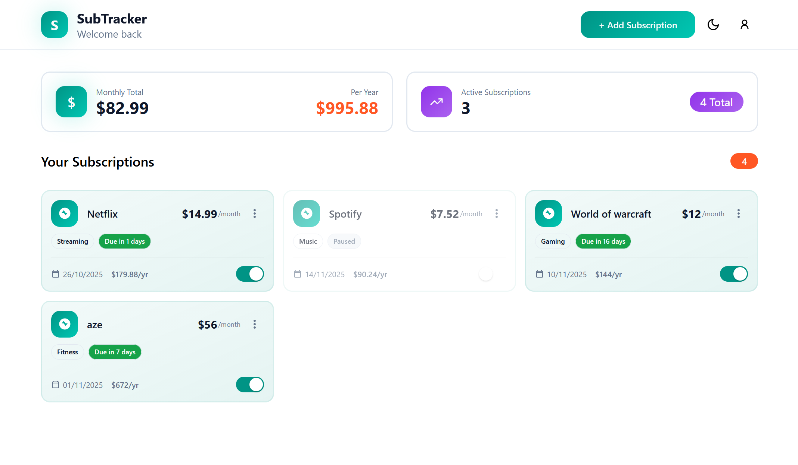

# SubManager - Subscription Management System

A web application for tracking and managing personal subscriptions with automatic monthly and yearly cost calculations.

## Context

Personal project developed to:
- Track my multiple subscriptions (streaming, SaaS, sports)
- Demonstrate proficiency with .NET and Angular in a business context
- Apply software architecture patterns (Clean Architecture, Repository Pattern, JWT Authentication)

## Features

- JWT authentication with refresh tokens
- Full CRUD operations for subscriptions
- Dashboard with statistics (total monthly/yearly costs)
- Multi-user support (isolated user data)
- Paginated results
- REST API with Swagger documentation

## Tech Stack

**Backend:**
- .NET 8 / C#
- ASP.NET Core Web API
- Entity Framework Core (Code First)
- PostgreSQL
- JWT Authentication
- Clean Architecture with Repository Pattern

**Frontend:**
- Angular 20 with Typescript

## Getting Started

### Manual Setup

**Database:**
Port : 5433
With Docker
```
docker run --name postgres-submanager -e POSTGRES_PASSWORD=postgres -e POSTGRES_DB=submanager -p 5433:5432 -d postgres
```

**Backend:**
```bash
cd SubManager.API
dotnet restore
dotnet-ef database update
dotnet run
```

**Frontend:**
```bash
cd web
npm install
ng serve
```

## API Documentation

Once running, access Swagger UI at: `http://localhost:5267/swagger/index.html`

**Main endpoints:**
- `POST /api/register` - Create new account
- `POST /api/login` - Authenticate user
- `GET /api/me/subscriptions` - Get user subscriptions (paginated)
- `POST /api/me/subscriptions` - Create subscription
- `GET /api/me/subscriptions/{id}` - Get subscription details
- `PUT /api/me/subscriptions/{id}` - Update subscription
- `DELETE /api/me/subscriptions/{id}` - Delete subscription

## Architecture
```
SubManager/
├── SubManager.API/          # Web API layer
├── SubManager.Application/  # Frontend application
├── SubManager.Domain/       # Domain entities and interfaces
├── SubManager.Infrastructure/ # Data access and external services
└── SubManager.Tests/        # Unit tests
```

**Design patterns:**
- Clean Architecture (separation of concerns)
- Repository Pattern (data access abstraction)
- Dependency Injection
- DTOs for API contracts

## Screenshots





## Testing
```bash
cd SubManager.Tests
dotnet test
```

## Deployment

Backend + Database: Railway

Frontend: Vercel

## License

This project is licensed under the MIT License - see the LICENSE file for details.
